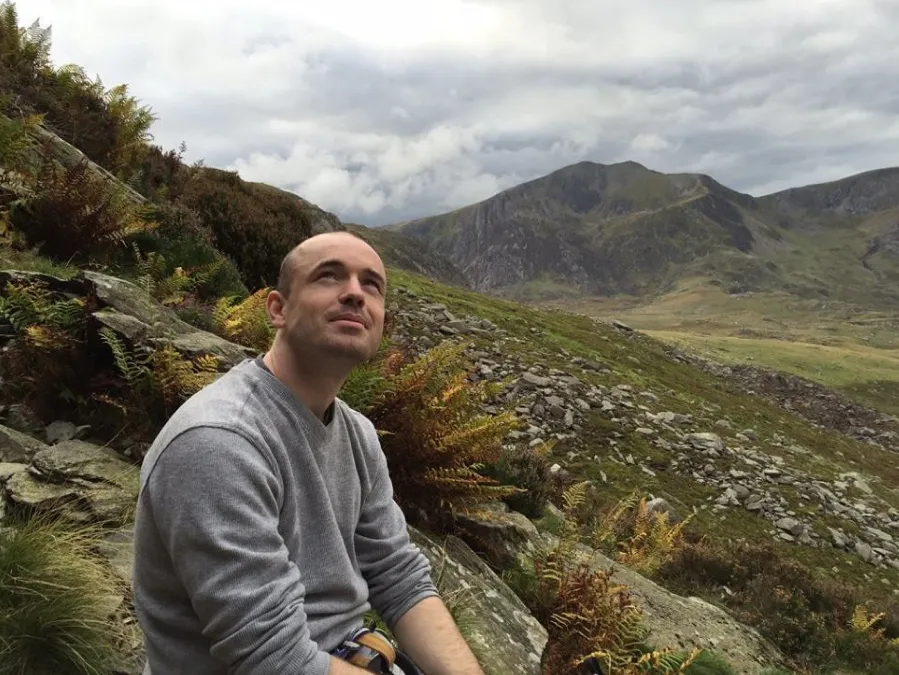

---
# Feel free to add content and custom Front Matter to this file.
# To modify the layout, see https://jekyllrb.com/docs/themes/#overriding-theme-defaults

layout: page
list_title: Articles
---

I’m Joe. If you'd like to know more about me as a person, you should read  [this post](). 

In 2021 I published [Advanced Memory Palaces](https://www.amazon.co.uk/Joe-Reddington/dp/B09GJFZ6JM), please buy it. 

The rest of the site is a collection of 400 or so posts of various odds-and-ends. I've been blogging since 2013 so topics range from webapps to [choosing colours for baby blankets](2015/11/04/its-not-baby-boy-blue.-its-sirius/html).

Occasionally either me or my work [appears in the press](media.html) and I can be contacted on [joe@joereddington.com](mailto:joe@joereddington.com). I am active on most social media, but the best place to find out what I’m working on and thinking about is <a href="https://www.facebook.com/joe.reddington" onclick="getOutboundLink('my facebook page')">my facebook page</a>  where I do a lot of talking about projects and designs before they make it here.

Thank you :) 

